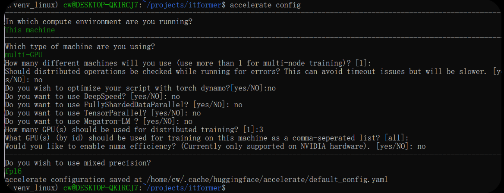
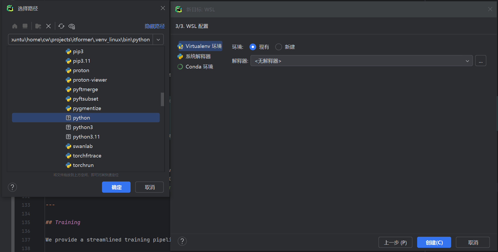

# M-Former

此资源库提供了M-Former（的官方开源实现，M-Former 是一种用于时间-文本多模态问答（QA）的新型框架。

## Overview

M-Former是一款用于时态-文本多模态问答的顶尖模型。此资源库提供了官方的开源实现版本，其中包括推理和训练脚本。

我们的研究引入了一个大规模的多任务数据集([PipelineManifold-QA][EngineMT-QA])，并展示了 M-Former 在将时间序列数据与自然语言理解相结合方面表现出的卓越性能。值得一提的是，我们的 0.5 亿参数模型体积小巧、运行高效，同时仍能取得出色的效果。

[EngineMT-QA]: https://huggingface.co/datasets/your-dataset

## Features

- 📊 **预训练模型**：在 Hugging Face 上可直接使用的 M-Former 模型 ([0.5B][M-Former0.5B], [3B][M-Former3B], [7B][M-Former7B])。
- 🚀 **轻量且高效**：0.5 亿参数的模型具备强大的时态问答能力，并且易于部署。([Qwen2.5-Instruct][Qwen2.5-Instruct])
- 🎯 **一键式脚本**：提供用于预训练、SFT（序列到序列训练）和并行推理的自动化脚本。
- 📈 **高性能**：在时态文本问答基准测试中取得了最先进的结果。
- 🌐 **分布式支持**：与 `accelerate` 完全兼容，适用于多 GPU 训练和推理。

[M-Former0.5B]: https://huggingface.co/your-username/M-Former-0.5B

[M-Former3B]: https://huggingface.co/your-username/M-Former-3B

[M-Former7B]: https://huggingface.co/your-username/M-Former-7B

[Qwen2.5-Instruct]:https://huggingface.co/Qwen/Qwen2.5-0.5B-Instruct

## Quick Start 

### 1. Organize Directory Structure

下载模型和数据集后，请按照以下方式整理您的文件：

<pre>
M-Former/
├── dataset/                         # 数据集处理
│   ├── dataset.py                   # 数据集加载器（PretrainDataset, TsQaDataset, DataCollator）
│   ├── datasets/                    # 存放 PipelineManifold-QA 数据集文件
│   │   ├── train_data.h5
│   │   ├── train_qa.jsonl
│   │   ├── test_data.h5
│   │   └── test_qa.jsonl
│   ├── original_data/               # 原始实验数据
│   ├── processing_data/             # 中间处理数据
│   ├── steps/                       # 数据处理流水线脚本
│   │   ├── 1. Inclined_pipe15_DP.py # 15度倾斜管数据处理
│   │   ├── 2. Inclined_pipe30_DP.py # 30度倾斜管数据处理
│   │   ├── 3. levelling_pipe_DP.py  # 水平管数据处理
│   │   ├── 4. combined.py           # 数据合并脚本
│   │   ├── 5. task_construction.py  # QA任务构建脚本
│   │   ├── 6. split_train_val.py    # 训练集/验证集划分
│   │   └── pipeline_data.json       # 管道元数据
│   └── pipeline_data.json           # 生成的完整数据集
│
├── models/                          # 模型定义
│   ├── __init__.py
│   ├── MFormer.py                   # MFormer 核心实现（MinimalLRU, BiLRU, MemoryTimeUnit）
│   ├── TimeLanguageModel.py         # 时间语言模型（TLM）整体架构
│   └── TimeSeriesEncoder.py         # 时间序列编码器
│
├── utils/                           # 工具函数
│   ├── __init__.py
│   ├── dist_util.py                 # 分布式训练工具
│   ├── gradio_vlm.py                # Gradio 界面组件
│   ├── log_util.py                  # 日志工具（防刷屏）
│   ├── metrics.py                   # 评测指标（BLEU, ROUGE, BERTScore）
│   └── position_coding.py           # 位置编码（正弦/可学习/旋转）
│
├── EXP/                             # 实验逻辑
│   ├── __init__.py
│   ├── exp_instruct.py              # SFT 指令微调实验
│   └── exp_pretraining.py           # 预训练实验
│
├── scripts/                         # 自动化脚本
│   ├── run_pretrain.sh              # 预训练启动脚本
│   ├── run_sft.sh                   # SFT 训练启动脚本
│   ├── run_inference.sh             # 推理启动脚本
│   ├── run_clean.sh                 # 数据清洗脚本
│   ├── run_all.sh                   # 全流程运行脚本
│   └── infra.bash                   # 基础设施脚本
│
├── yaml/                            # 配置文件
│   ├── accelerate_config.yaml       # Accelerate 分布式配置
│   └── infer.yaml                   # 推理参数配置
│
├── LLM/                             # 基础语言模型
│   └── Qwen2.5-0.5B-Instruct/      # Qwen2.5 指令模型
│
├── assets/                          # 静态资源（图片等）
├── save/                            # 模型保存目录
│   ├── pretrain/                    # 预训练模型
│   ├── pretrain_ts_small/           # 小型预训练模型
│   └── sft_qwen2.5_0.5B/           # SFT 微调后模型
│
├── reference/                       # 参考文献
├── swanlog/                         # SwanLab 训练日志
├── inference_results/               # 推理结果输出
├── .venv_linux/                     # Python 虚拟环境
├── train_pretrain.py                # 预训练入口
├── train_sft.py                     # SFT 训练入口
├── inference.py                     # 推理入口
├── clean_dataset.py                 # 数据集清洗工具
├── verify_qa.py                     # QA数据验证工具
├── requirements.txt                 # Python 依赖
├── .gitignore                       # Git 忽略配置
└── README.md                        # 项目说明文档
</pre>

### 2. Environment Setup and Dependencies
使用 WSL2 (Ubuntu 22.04/24.04) 在 Windows 内部挂载 Linux 内核，以便配置分布式训练和推理。

在管理员权限的 PowerShell 中运行
```
wsl --update
# 查看你当前系统中可用的在线分发版列表
wsl --list --online
# 如果列表里只有 Ubuntu，就用这个
wsl --install -d Ubuntu
```
---
按下键盘上的 Win 键，在搜索框里输入 “Ubuntu”。
```
# 查看WSL2与联Windows的显卡驱动的关联情况
nvidia-smi
# 准备venv 组件
sudo apt update
sudo apt install python3.11-venv -y
# 在linux 的用户主目录，创建一个存放项目的文件夹。把项目从 Windows 桌面拷贝过来 (注意路径)；(在 Ubuntu 中，Windows 的 C 盘挂载在 /mnt/c/)
cd ~
mkdir -p projects
cp -r /mnt/c/Users/cw/Desktop/M-Former ./mformer
cd mformer
# 创建虚拟环境
python3.11 -m venv .venv_linux
source .venv_linux/bin/activate
pip install -r requirements.txt
# 配置 Accelerate
accelerate config
```
Accelerate的配置选择



---

Windows中PyCharm中连接wsl中的虚拟环境



## Validation and Testing

修改后始终运行这些验证步骤：

```bash
# 1. 测试核心导入（快速验证）
python -c "from models.TimeLanguageModel import TLM, TLMConfig; from dataset.dataset import TsQaDataset; from utils.metrics import open_question_metrics; print('✅ All modules import successfully')"

# 2. 测试推理脚本帮助（验证参数解析）
python inference.py --help

# 3. 所有Python文件的语法验证
find . -name "*.py" -exec python -m py_compile {} \;

# 4. 测试基本模型初始化（需要下载模型）
python -c "
import yaml
with open('yaml/infer.yaml', 'r') as f:
    config = yaml.safe_load(f)
print('✅ Configuration file loads correctly')
"
```

## Run Inference

我们支持使用“accelerate”库进行“并行推理”。这会自动汇总来自多个 GPU 的结果。

```bash
# 使用自动化脚本（推荐）
bash scripts/run_inference.sh

# 或者通过accelerate手动启动
accelerate launch --config_file yaml/accelerate_config.yaml inference.py --config yaml/infer.yaml

# 方法 1：直接使用 Python 进行执行（单个 GPU/单个 CPU）
python inference.py --config yaml/infer.yaml
# 方法 2：使用加速功能的多 GPU 设备（推荐用于生产环境）
accelerate launch --config_file yaml/accelerate_config.yaml inference.py --config yaml/infer.yaml

# 方法 3：使用所提供的脚本
bash scripts/run_inference.sh
bash scripts/run_inference.sh
```

该推理脚本将：
- 加载 MFormer 及其对应的 Qwen2.5-Instruct 版本。
- 将数据分配到所有可用的 GPU 上。
- 对结果进行汇总并保存到 `inference_results/` 目录以及 `output_result_all.json` 文件中。


监控推理进度：
```bash
# 查看输出目录的结果
watch ls -la inference_results/

# 监控GPU使用情况（如果可用）
nvidia-smi -l 5
```
## Training

我们使用“accelerate”库提供了一套简洁高效的训练流程。请确保您的“accelerate_config.yaml”文件已针对您的硬件进行了正确配置。

### A. Pre-training (Time-Series Encoder)

阶段 A 的重点是使用掩码建模对`TimeSeriesEncoder`进行预训练。

```bash
# 一键预训练
source .venv_linux/bin/activate
bash scripts/run_pretrain.sh
```

### B. Supervised Fine-Tuning (SFT)

阶段 B 执行端到端的 SFT，通过 MFormer 将 TimeSeriesEncoder 与 LLM 桥接。
```bash
# # 单步 SFT（需预先加载 ts_encoder 的权重）
source .venv_linux/bin/activate
bash scripts/run_sft.sh
```

**SFT 中的关键参数：**
- `--m_d_model`、`--m_n_heads`、`--m_layers`：这是 MFormer 模块的配置参数。
- `--load_ts_encoder`：指向在阶段 A 中生成的权重文件的路径。
- `--llm_model_path`：指向基础 Qwen2.5-Instruct 模型的路径。

---

## Configuration

主配置文件： yaml/infer.yaml

你可能需要修改的关键参数：
- ts_path_test : 时间序列数据文件路径
- qa_path_test ：QA 对文件的路径
- batch_size : 推理批次大小（默认：12）
- 与 GPU 相关的设置由 accelerate_config.yaml 处理

## Key Components 

核心模块位置：
- `models/TimeLanguageModel.py` : 时间语言模型（TLM）整体架构，整合 TS Encoder、MFormer 和 LLM
- `models/MFormer.py` : MFormer 核心实现，包含 MinimalLRU、BiLRU、MemoryTimeUnit 等组件
- `models/TimeSeriesEncoder.py` : 时间序列编码器，基于 PatchTST 架构
- `dataset/dataset.py` : 数据加载和预处理（PretrainDataset、TsQaDataset、DataCollator）
- `utils/metrics.py` : 评估问答性能的指标（BLEU、ROUGE、BERTScore）
- `utils/position_coding.py` : 位置编码实现（正弦/可学习/旋转）
- `yaml/infer.yaml` : 主配置文件
- `yaml/accelerate_config.yaml` : 多 GPU 加速设置

模型架构：
- **TimeSeriesEncoder**: 基于 PatchTST 的时间序列编码器
- **MFormer**: 连接时间序列编码器和 LLM 的桥梁，包含：
  - MinimalLRU: 基于并行扫描的极简线性递归单元
  - BiLRU: 双向 LRU 动力学处理模块
  - MemoryTimeUnit: 记忆时间单元，实现时序数据与文本的融合
- **Qwen2.5-Instruct**: 基础大语言模型


## Performance Expectations

MFormer 模型性能：
- 0.5B 模型：在时间问答方面超越 ChatGPT-4o，推理速度最快
- 3B 模型：平衡性能与速度
- 7B 模型：最佳准确率，最慢推理

inference的资源需求：
- 最低 RAM：8GB（适用于 0.5B 模型）
- 推荐 RAM：16GB+（适用于 3B+）
- GPU 显存：4GB+（0.5B），12GB+（7B）
- 存储空间：所有模型和数据集需 50GB+

## Development Workflow

1. 始终首先验证导入 - 运行导入验证命令
2. 在尝试较大模型前先用最小模型（0.5B）进行测试
3. 当 GPU 资源有限时使用 CPU 模式进行测试
4. 监控推理运行期间的内存使用情况
5. 检查生成的结果和指标目录 inference_results/
6. 验证 yaml/infer.yaml 中的配置路径是否与您的目录结构匹配
